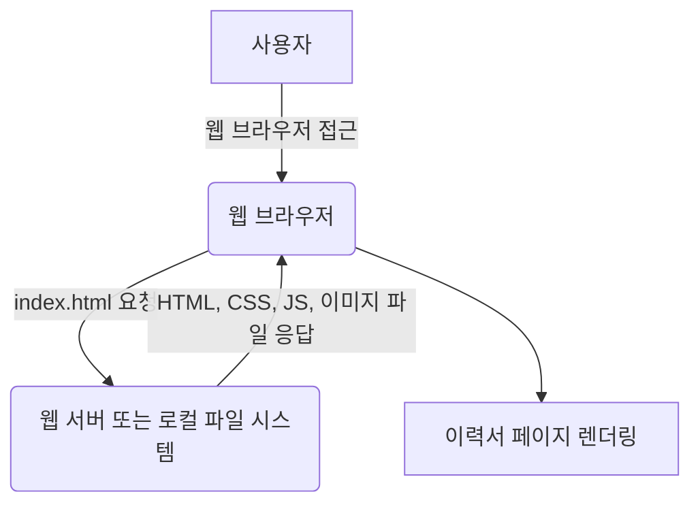

## Title & Banner


나를 담아내는, 당신만의 이력서

## Description

이 프로젝트는 개인의 경험과 역량을 효과적으로 시각화하여 표현하기 위한 웹 기반 이력서(Resume)를 제작하는 것을 목표로 합니다. 정적이고 획일적인 이력서의 한계를 넘어, 개성을 담고 필요한 정보를 명확하게 전달할 수 있는 개인 맞춤형 이력서 페이지를 구축합니다.

-   **개요 및 목적**: 개인의 학력, 경력, 기술 스택, 프로젝트 경험 등을 일목요연하게 정리하고 웹 환경에서 접근 가능하도록 제공하여, 구직 활동이나 포트폴리오 제출 시 활용될 수 있도록 합니다.
-   **타겟 독자**: 취업 준비생, 이직을 희망하는 경력직, 개인 포트폴리오가 필요한 프리랜서 등 자신의 전문성을 효과적으로 어필하고자 하는 모든 개인.
-   **문제점**: 기존 이력서 양식의 제약으로 인해 개인의 독창적인 강점이나 다양한 경험을 충분히 담아내기 어려운 점을 해결하고, 웹 접근성을 통해 언제 어디서든 자신의 정보를 공유할 수 있도록 합니다.
[내용 추가: 프로젝트의 구체적인 비전이나 차별점을 더 설명할 수 있습니다.]

## 핵심 기능

*   **개인 정보 섹션**: 이름, 연락처, 이메일, 소셜 미디어 링크 등 기본적인 개인 정보를 명확하게 표시합니다.
*   **경력 및 학력 섹션**: 이전 직장 경험, 학위, 교육 과정 등 이력의 주요 내용을 시간 순서대로 정리하여 보여줍니다.
*   **기술 스택 섹션**: 보유하고 있는 프로그래밍 언어, 프레임워크, 도구 등 기술 역량을 시각적으로 강조합니다.
*   **프로젝트/포트폴리오 섹션**: 참여했던 프로젝트나 개인 작업물을 소개하고, 관련 링크를 제공하여 상세 내용을 확인할 수 있도록 합니다.
*   **반응형 디자인**: 다양한 디바이스(데스크톱, 태블릿, 모바일)에서 최적화된 형태로 이력서가 보여지도록 지원합니다.
[내용 추가: 특정 기능이나 사용자 경험 측면에서 강조하고 싶은 부분을 추가하세요.]

## Tech Stack

본 프로젝트는 다음과 같은 기술 스택을 활용하여 개발되었습니다.

*   **Primary Language**: 
*   **Styling**: 
*   **Scripting**: 

[내용 추가: 사용된 특정 라이브러리나 툴이 있다면 여기에 추가하세요.]

## Structure

프로젝트의 `src` 디렉토리 구조는 다음과 같습니다.

```
src/
├── index.html          # 메인 이력서 페이지
├── assets/             # 정적 자원 (CSS, JS 등)
│   ├── css/
│   │   └── style.css   # 전역 스타일 시트
│   └── js/
│       └── main.js     # 주요 스크립트 파일
└── img/                # 이미지 파일 (프로필 사진, 아이콘 등)
    └── profile.jpg
```

[내용 추가: 더 복잡한 구조를 가지고 있다면 상세히 설명하거나 다이어그램으로 표현할 수 있습니다.]

## Architecture

본 프로젝트는 클라이언트 측에서만 동작하는 정적 웹 페이지 형태로 구성됩니다. 사용자가 웹 브라우저를 통해 `index.html` 파일을 요청하면, 서버(또는 로컬 파일 시스템)에서 해당 HTML 파일과 연결된 CSS, JavaScript, 이미지 파일들을 전송합니다. 이후 브라우저가 이 파일들을 해석하여 이력서 페이지를 렌더링하고 사용자에게 보여줍니다.



[더 자세한 정보: 만약 백엔드나 데이터베이스가 연동되어 있다면 해당 구성도를 추가할 수 있습니다.]

## Installation

프로젝트를 로컬 환경에서 실행하고 확인하는 방법은 매우 간단합니다.

1.  **리포지토리 클론**:
    ```bash
    git clone https://github.com/your-username/resume.git
    cd resume
    ```

2.  **프로젝트 열기**:
    `src` 디렉토리 내의 `index.html` 파일을 선호하는 웹 브라우저(예: Chrome, Firefox)로 직접 엽니다.

    ```bash
    # (선택 사항) VS Code의 Live Server 확장 등을 사용하여 열 수 있습니다.
    # 또는 파일 탐색기에서 src/index.html 파일을 더블 클릭합니다.
    ```

이제 브라우저에서 이력서 페이지를 확인할 수 있습니다.
[내용 추가: 추가적인 설정이나 개발 환경 구축이 필요한 경우 여기에 명시하세요.]